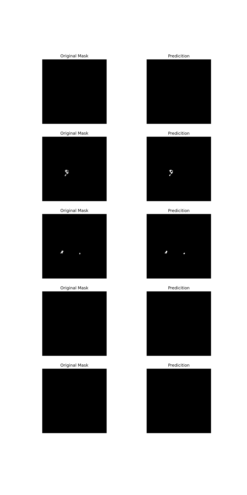
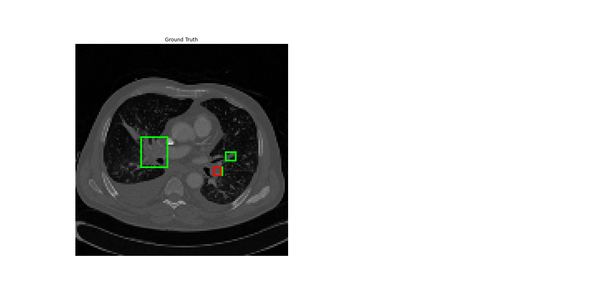

# CAD-PE-SegLoc: Computer Aided Detection for Pulmonary Embolism

## Overview
This repository contains code for segmentation and localization tasks in Computer Aided Detection for Pulmonary Embolism (CAD-PE). The project uses a UNet model for segmentation and a Faster R-CNN model for localization. The dataset is structured into separate folders for localization and segmentation tasks.

## Data Visualization

<div style="display: flex; justify-content: space-between; align-items: center;">

  <div>
    
    <p><em>Caption: A sample CAD PE CT image from the dataset.</em></p>
  </div>

  <div>
    
    <p><em>Caption: A sample CAD PE CT Mask from the dataset.</em></p>
  </div>

</div>


## Folder Structure

- `cadpe_localization/`:
  - `data/`: Localization dataset

- `cadpe_segmentation/`:
  - `dataset/`: Segmentation dataset
  - `model_org/`: Segmentation model
  - `train/`: Segmentation training pipeline

- `images/`: Visualization images for CAD-PE segmentation and localization

- `notebooks/`:
  - Notebooks for both localization and segmentation tasks

- `utils/`:
  - `coco_format.py`: Utility script to generate COCO format
  - `coco_dataset.json`: Dataset JSON file in COCO format
  - `getbbox_and_plot.py`: Utility script for getting bounding boxes and generating plots

## Getting Started

1. **Clone the Repository:**
   ```bash
   git clone https://github.com/your-username/CAD-PE-SegLoc.git
   cd CAD-PE-SegLoc
   ```

2. **Data Preparation:**
   - For localization, place your localization dataset in `cadpe_localization/data/`.
   - For segmentation, place your segmentation dataset in `cadpe_segmentation/dataset/`.

3. **Training:**
   - Navigate to `cadpe_localization/train/` for localization model training.
   - Navigate to `cadpe_segmentation/train/` for segmentation model training.

4. **Notebooks:**
   - Explore the `notebooks/` directory for Jupyter notebooks covering analysis, training, and evaluation.

## Utils

- `coco_format.py`: Use this script to convert your dataset to COCO format.
- `coco_dataset.json`: COCO format dataset JSON file.
- `getbbox_and_plot.py`: Script for extracting bounding boxes and generating plots.

## Results

*Caption: Results of CAD-PE Segmentation*


*Caption: Results of CAD-PE Localization*

## Acknowledgments

- This project utilizes the PyTorch implementation, developed by the PyTorch community. Check out their official repository: [PyTorch](https://github.com/pytorch/pytorch).

- If you use or reference the CAD-PE dataset, please provide proper attribution as per the following publication:
  ```plaintext
  @article{gonzalez2020computer,
    title={Computer aided detection for pulmonary embolism challenge (CAD-PE)},
    author={Gonz{\'a}lez, Germ{\'a}n and Jimenez-Carretero, Daniel and Rodr{\'\i}guez-L{\'o}pez, Sara and Cano-Espinosa, Carlos and Cazorla, Miguel and Agarwal, Tanya and Agarwal, Vinit and Tajbakhsh, Nima and Gotway, Michael B and Liang, Jianming and others},
    journal={arXiv preprint arXiv:2003.13440},
    year={2020}
  }

Feel free to customize the content based on your specific project details and requirements.


